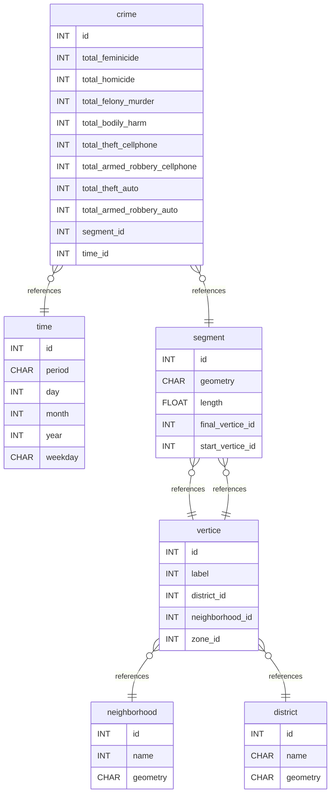

# PolRoute-DS-with-hive

Este projeto tem como objetivo demonstrar o uso do Apache Hive como ferramenta de Data Warehouse para análise de dados relacionados à segurança pública, utilizando um conjunto de dados de datas. A solução é construída sobre um ambiente Docker, o que facilita a replicação e portabilidade da configuração.

## HiveServer2

Fonte: [https://hub.docker.com/r/apache/hive](https://hub.docker.com/r/apache/hive)

A imagem inclui uma instalação do Apache Hive, um sistema de data warehouse baseado no Hadoop que permite executar consultas SQL (usando HiveQL) em grandes volumes de dados distribuídos.

O comando inicializa o HiveServer2 — um serviço que aceita conexões via JDBC/ODBC para executar consultas HiveQL — junto com um Metastore incorporado na mesma instância. Dessa forma, tudo funciona dentro de um único container, sem precisar configurar um banco de dados separado para o Metastore.

Para rodar o container, execute:

```bash
docker run -d -p 10000:10000 -p 10002:10002 --env SERVICE_NAME=hiveserver2 --name hive4 apache/hive:${HIVE_VERSION}
```

Acesse o Beeline dentro do container:

```bash
docker exec -it hive4 beeline -u 'jdbc:hive2://localhost:10000/'
```

Acesse o HiveServer2 Web UI no navegador em `http://localhost:10002/`.

## Execução Bash

A execução dos arquivos bash segue as premissa de que os arquivos CSV estão disponíveis localmente.

## Diagrama da Base de Dados

