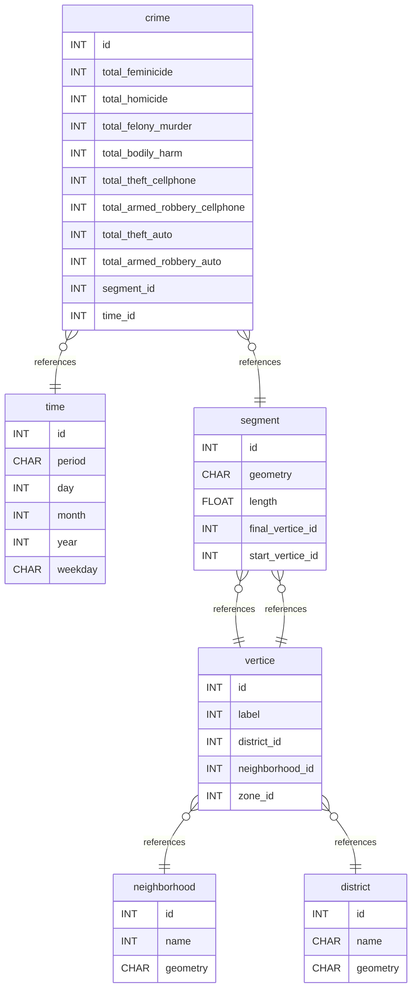

# PolRoute-DS-with-hive

Este projeto tem como objetivo demonstrar o uso do Apache Hive como ferramenta de Data Warehouse para análise de dados relacionados à segurança pública, utilizando um conjunto de dados de datas. A solução é construída sobre um ambiente Docker, o que facilita a replicação e portabilidade da configuração.

## HiveServer2

Fonte: [https://hub.docker.com/r/apache/hive](https://hub.docker.com/r/apache/hive)

A imagem inclui uma instalação do Apache Hive, um sistema de data warehouse baseado no Hadoop que permite executar consultas SQL (usando HiveQL) em grandes volumes de dados distribuídos.

O comando inicializa o HiveServer2 — um serviço que aceita conexões via JDBC/ODBC para executar consultas HiveQL — junto com um Metastore incorporado na mesma instância. Dessa forma, tudo funciona dentro de um único container, sem precisar configurar um banco de dados separado para o Metastore.

Para rodar o container, execute:

```bash
docker run -d -p 10000:10000 -p 10002:10002 --env SERVICE_NAME=hiveserver2 --name hive4 apache/hive:${HIVE_VERSION}
```

Acesse o Beeline dentro do container:

```bash
docker exec -it hive4 beeline -u 'jdbc:hive2://localhost:10000/'
```

Acesse o HiveServer2 Web UI no navegador em `http://localhost:10002/`.

## Carregar CSV no Apache Hive (via container Docker)

### Premissas

- O arquivo CSV está disponível localmente.
- O CSV possui cabeçalho na primeira linha (que deve ser ignorado no carregamento).

# Diagrama do Banco de Dados
## Summary

- [Table Structure](#table-structure)
	- [crime](#crime)
	- [time](#time)
	- [segment](#segment)
	- [vertice](#vertice)
	- [neighborhood](#neighborhood)
	- [district](#district)
- [Database Diagram](#database-diagram)

## Table structure

### crime

| Name        | Type          | Settings                      | References                    | Note                           |
|-------------|---------------|-------------------------------|-------------------------------|--------------------------------|
| **id** | INT | 🔑 PK, not null, unique |  | |
| **total_feminicide** | INT | null |  | |
| **total_homicide** | INT | null |  | |
| **total_felony_murder** | INT | null |  | |
| **total_bodily_harm** | INT | null |  | |
| **total_theft_cellphone** | INT | null |  | |
| **total_armed_robbery_cellphone** | INT | null |  | |
| **total_theft_auto** | INT | null |  | |
| **total_armed_robbery_auto** | INT | null |  | |
| **segment_id** | INT | null | fk_crime_segment_id_segment | |
| **time_id** | INT | null | fk_crime_time_id_time | | 


### time

| Name        | Type          | Settings                      | References                    | Note                           |
|-------------|---------------|-------------------------------|-------------------------------|--------------------------------|
| **id** | INT | 🔑 PK, not null, unique |  | |
| **period** | CHAR | null |  | |
| **day** | INT | null |  | |
| **month** | INT | null |  | |
| **year** | INT | null |  | |
| **weekday** | CHAR | null |  | | 


### segment

| Name        | Type          | Settings                      | References                    | Note                           |
|-------------|---------------|-------------------------------|-------------------------------|--------------------------------|
| **id** | INT | 🔑 PK, not null, unique | fk_segment_id_vertice | |
| **geometry** | CHAR | null |  | |
| **length** | FLOAT | null |  | |
| **final_vertice_id** | INT | null | fk_segment_final_vertice_id_vertice | |
| **start_vertice_id** | INT | null |  | | 


### vertice

| Name        | Type          | Settings                      | References                    | Note                           |
|-------------|---------------|-------------------------------|-------------------------------|--------------------------------|
| **id** | INT | 🔑 PK, not null, unique |  | |
| **label** | INT | null |  | |
| **district_id** | INT | null | fk_vertice_district_id_district | |
| **neighborhood_id** | INT | null | fk_vertice_neighborhood_id_neighborhood | |
| **zone_id** | INT | null |  | | 


### neighborhood

| Name        | Type          | Settings                      | References                    | Note                           |
|-------------|---------------|-------------------------------|-------------------------------|--------------------------------|
| **id** | INT | 🔑 PK, not null, unique |  | |
| **name** | INT | null |  | |
| **geometry** | CHAR | null |  | | 


### district

| Name        | Type          | Settings                      | References                    | Note                           |
|-------------|---------------|-------------------------------|-------------------------------|--------------------------------|
| **id** | INT | 🔑 PK, not null, unique |  | |
| **name** | CHAR | null |  | |
| **geometry** | CHAR | null |  | | 


## Database Diagram

